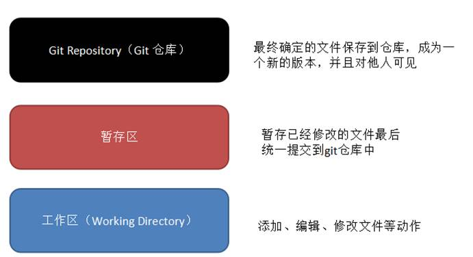
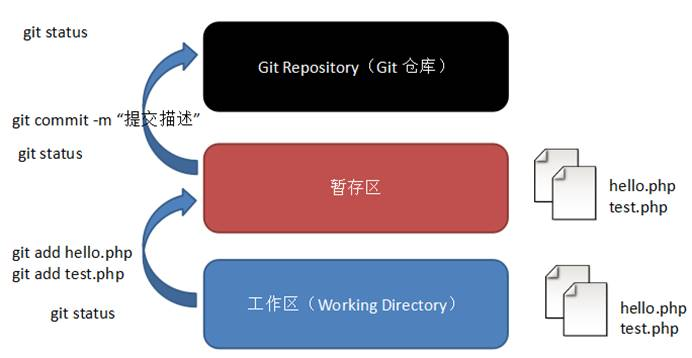
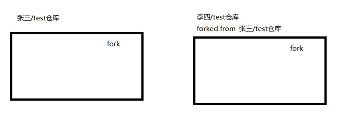
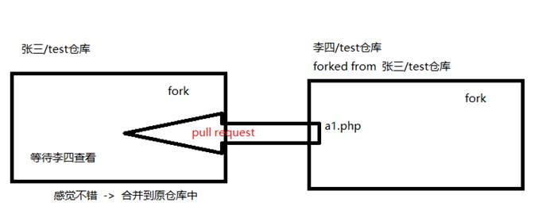
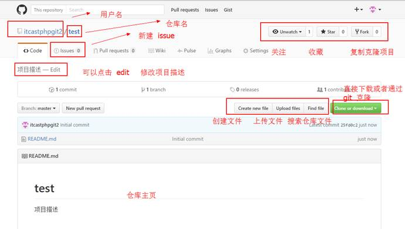
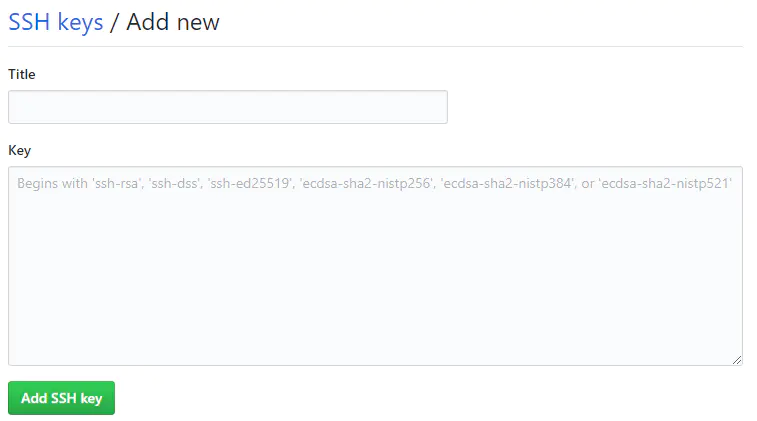

参考：[git简明指南](https://rogerdudler.github.io/git-guide/index.zh.html)，[Git和GitHub使用教程](https://www.jianshu.com/p/296d22275cdd)，[B站教程](https://www.bilibili.com/video/BV1Xx411m7kn?p=10)

[TOC]

### 1.了解Git和Github

#### 1.1 什么是Git

Git是一个免费、开源的版本控制软件。版本控制是一种记录一个或若干个文件内容变化，以便将来查阅特定版本修订情况的系统。

具体功能：

1. 记录文件所有的历史变化
2. 随时可恢复到任何一个历史状态
3. 多人协作开发或修改
4. 错误恢复

#### 1.2 什么是Github

Github是世界上最大的软件远程仓库，是一个面向开源和私有软件项目的托管平台，使用Git来做分布式版本控制。

当我需要开发某个东西的时候，可以尝试去Github上借鉴别人已经开发过的。

或者需要跟小伙伴们打算开发一个小软件，可以将代码放到Github上来实现合作开发。

#### 1.3 Github和Git关系

Git是版本控制软件。

Github是项目代码托管的平台，借助git来管理项目代码。

### 2. Git入门

#### 2.1 Git的作用

举个例子

1.假设我是公司的一名程序员，我写了一段程序

```
print("hello");
```

2.老板让你修改成

```
print("你好");
```

3.老板让你回到上一次的状态

如果你从1改到2改了一大半内容，并且没有留1 的备份，是不是要哭了？但是在这个时候使用Git做版本控制，就不会有这个问题了。每一次修改代码后，都会使用Git做一次记录，Git就知道你每一次修改了什么内容。

老板让你回到1，只需要输入```git reset --hard 1```，就能回到当时的版本。

==所以说，Git就是实现历史版本的工具，不论我改了多少内容，改了多少次，Git都能回到当时的版本。==

#### 2.2 Git使用

git工作区域

  

向仓库中添加文件流程

​           

windows打开GitBash。

##### 1. 设置身份

内容有两条，一个是称呼，一个是邮箱，以后你提交的代码都根据这个来确定是你。

输入

```
git config --global user.name "liuXin"
git config --global user.email "liuxinoe@126.com"
```

##### 2. 初始化代码仓库

进入仓库根目录，执行

```
git init
```

##### 3. 添加文件

```
$ git add hello.txt
$ git commit -m "add hello.txt"
```

git add命令把文件添加到仓库缓存区中；

git commit把缓存区中的所有文件正式提交到仓库

##### 4. 删除文件夹

```
git rm -r --cached "文件夹的名称" 
git commit -m "更新log"
git push origin master
```

##### 5.实现版本回退

输入git log命令查看版本情况

```
git log
```

会显示过去所有的修改时间、修改人、修改内容；

```
commit 84214249d055065fca6c5061d2f798ecdd363789 (HEAD -> master)
Author: liuXin <liuxinoe@126.com>
Date:   Tue Jan 26 10:41:03 2021 +0800

    hello.txt添加了一句话

commit 396c7c8cf6271443871fa7a9af0ec83ba43cba1f
Author: liuXin <liuxinoe@126.com>
Date:   Tue Jan 26 10:39:37 2021 +0800

    add hello.txt

```

可以看到最新的提交在上面，并按时间由近到远，每一次提交修改都会生成一个commit id，我们可以 认为这个id是当时的版本号，这个commit id是我们回到当时版本的唯一凭据。

```
git reset --hard HEAD^  ;回到上一版本
git reset --hard HEAD^^  ;回到上上一版本
git reset --hard HEAD~1 ;回到上一版本
git reset --hard HEAD~100 ;回到上100个版本

git reset --hard 8421424 ;通过指定commit id回退
```

Git的版本回退速度非常快，因为Git在内部有一个指向当前版本的HEAD指针， 当你回退版本的时候，Git仅仅是把HEAD从指向某个版本： 

  

##### 5. 超级后悔药

当回退到某个版本，关了电脑，第二天早上就后悔了，想恢复到新版本怎么办？找不到新版本的commit id怎么办？

在Git中，提供一个git reflog来记录你的每一次命令。

```
$ git reflog
396c7c8 (HEAD -> master) HEAD@{0}: reset: moving to HEAD~1
8421424 HEAD@{1}: commit: hello.txt添加了一句话
396c7c8 (HEAD -> master) HEAD@{2}: commit (initial): add hello.txt

$ git reset --hard 8421424 ;后悔药
```

### 3. 使用Github

#### 3.1 基本概念

##### 仓库（Repository）

仓库用来存放项目代码，每个项目对应一个仓库

##### 收藏（Star）

收藏项目，方便下次查看

##### 克隆（Fork）

​           

fork的项目是单独存在的，与被fork项目互不影响，

##### 发起请求（pull request）

​           

##### 关注（Watch）

关注项目，当项目更新时可以接收到通知

##### 事务卡片（Issue）

发现代码Bug，但是目前没有成型代码，需要公开讨论；

#### 3.2 Github页面

##### 仓库主页

​           

#### 3.3 Github账户管理

1）github注册账号

2）创建SSH Key。在用户目录下，看看有没有.ssh，如果没有，则创建SSH Key:

```
ssh-keygen -t rsa -C "liuxinoe@126.com"
```

3）登录Github，点击"setting"，"SSH Keys and GPG keys"页面，点“New SSH Key”,填上任意Title,在Key文本框里粘贴id_rsa.pub文件里面的内容即可。

  

为什么Github需要SSH Key呢？因为Github需要识别出你推送的提交确实是你推送的，而不是比尔冒充的，而Git支持SSH协议，所以Github知道你的公钥，就可以确认你的身份。

#### 3.4 结合Git创建Github仓库

##### 方法一：本地已有

把本地已有同名的Git仓库和Github上的仓库关联起来。

```
git init 
git add hello.txt
git commit -m "first commit"
```

目前为止已经提交到本地仓库

接下来我们把本地仓库和远程仓库联系起来

```
git remote add origin git@github.com:happyXinx/HappyStudy.git
```

下一步，把本地库的所有内容推送到远程库上

```
git push -u origin master
```

由于远程库是空的，我们第一次推送master分支时，加上了-u参数，Git不但会把本地的master分支内容推送到远程新的mater分支，还会把本地的master分支关联起来，在以后的推送和拉去时就可以简化命令。

此后，就直接使用

```
git push origin master
```

##### 方法二：本地没有

直接克隆到本地

```bash
git clone git@github.com:smuyyh/BookReader.git
```

### 4. Github+Typora完美云笔记

参考https://blog.csdn.net/qq_38056704/article/details/84765586


