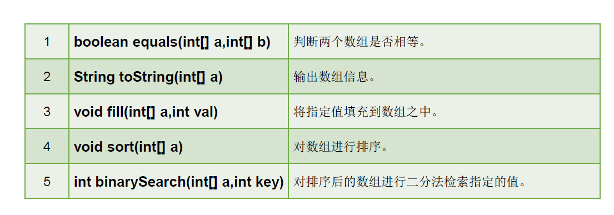

### 1. Java语言概述

#### 1.1 java语言特点

##### 1）面向对象

类、对象；封装、继承、多态

##### 2）健壮性

吸收了C/C++语言的优点，但去掉了其影响程序健壮性的部分（如指针、内存的申请和释放等），提供了一个相对安全的内存管理和访问机制。

##### 3）跨平台性

需要先安装Java虚拟机（JVM JAVA VIRTUAL MACHINE）


#### 1.2 核心机制

##### Java虚拟机 (Java Virtual Machine)

JVM是一个虚拟的计算机，具有指令集并使用不同的存储区域。负责执行指令，管理数据、内存、寄存器。


##### 垃圾收集机制（Garbage Collection）

#### 1.3 环境搭建

##### JDK

Java Development Kit Java开发工具包

##### JRE

Java Runtime Environment Java运行环境

##### JDK JRE JVM三者关系


简单来说，使用JDK的开发工具完成的Java程序，交给JRE去运行。


##### 下载JDK

##### 配置环境变量

环境变量：windows操作系统执行命令时所要搜寻的路径。

根据windows系统在查找可执行程序的原理，可以将java工具所在路径定义到path环境变量中。

步骤：

1）新增JAVA_HOME=JDK所在路径

2）path中添加%JAVA_HOME%\bin;

3)  dos中输入java， javac， java -version等命令验证环境变量是否配置成功

#### 1.4  HelloWorld开发

步骤：

1. 编写.java文件；
2. 通过javac命令对该java文件进行编译；
3. 通过java命令对生成的class文件运行。


Test.java内容

```java
public class Test{
    public static void main(String[] args){
        System.out.println("Hello world");
    }
}
```

编译，运行

```
javac Test.java
java Test
```

注意：

* Java语言严格区分大小写
* 一个源文件最多只能有一个public类，其他类的个数不限；如果源文件包含一个public类，则文件名必须按该类名命名。

#### 1.5 注释

注释类型：

单行注释

* 格式： //

多行注释

* 格式： /*   */

文档注释

* 格式：

  /** 

  @author: liuxin

  @version: v2.0

   */

* 注释内容可以被JDK所提供的工具javadoc所解析，生成一套网页形式的说明文档。

* 代码

  ```
  javadoc -d mydoc -author -version HelloWorld.java 
  ```

  若包含中文，则需要指定编码

  ```
  javadoc -d mydoc -author -version -encoding UTF-8 -charset UTF-8  HelloWorld.java
  ```

#### 1.6 Java API

Application  Programming Interface， 应用程序编程接口是Java提供的基本编程接口。

Java语言提供了大量的基础类，提供了相应的方法，API文档用于告诉开发者如何使用这些类，以及这些类里包含的方法。

### 2. Java基础语法

#### 2.1 关键字和保留字

关键字被Java语言赋予了特殊含义，用做专门用途的字符串（单词）

特点：关键字中所有字母小写。


保留字：现有Java版本尚未使用，但以后版本可能会作为关键字使用。

#### 2.2 标识符

Java对各种变量、方法和类等要素命名时使用的字符序列称为标识符。

规则：

* 由26个英文字母大小写，0-9 _ $组成
* 数字不可以开头
* 不能使用关键字和保留字，但能包含关键字和保留字
* 严格区分大小写，无长度限制
* 不能包含空格

命名规范：

* 包名：xxxyyyzzz
* 类名、接口名：XxxYyyZzz
* 变量名、方法名：xxxYyyZzz
* 常量名：XXX_YY_ZZZ

#### 2.3 基本数据类型

##### 1. 变量

包括变量类型、变量名和存储的值

注意：

* 先声明、后使用
* 变量的作用域：其定义所在的{}内
* 变量只在其作用域内才有效
* 同一作用域，不能重名

```
int var; 声明
var = 10; 赋值
int var=10; 声明和赋值
```

##### 2.数据类型

按类型分


按声明位置不同

成员变量：在方法体外，类体声明的变量称为成员变量

局部变量：在方法体内，声明的变量称为局部变量


##### 3. 整数类型

| 类型  | 占用存储空间 | 范围               |
| ----- | ------------ | ------------------ |
| byte  | 1字节        | -128-127           |
| short | 2字节        | $-2^{15}-2^{15}-1$ |
| int   | 4字节        | $-2^{31}-2^{31}-1$ |
| long  | 8字节        | $-2^{63}-2^{63}-1$ |

Java整形变量默认为int，声明long型后加l或L;

##### 4. 浮点类型

| 类型   | 占用存储空间 | 范围                 |
| ------ | ------------ | -------------------- |
| float  | 4字节        | -3.403E38-3.403E38   |
| double | 8字节        | -1.798E308-1.798E308 |

float：单精度，尾数可以精确到7位小数

double: 双精度，精度是float的两倍。

Java浮点类型，默认为double，声明float，需后面加f或F。

##### 5. 字符类型

==占两字节==

Java中所有字符都是用Unicode编码，故一个字符可存储一个字母。

字符型变量的三种表现形式：

* char c='a'; 
* char c='\n'; 转义字符来表示特殊字符型常量
* 直接使用Unicode值来表示。char c='\u000a';

Unicode：一种编码，将世界上所有的符号都纳入其中。每一个符号都给予一个独一无二的编码，使用Unicode编码没有乱码的问题。

UTF-8是一种变长的编码方式。可以使用1-6个字节表示一个符号，根据不同的符号而变化字节长度。

* 对于单字节的UTF-8编码，该字节的最高位为0，其余7位用来对字符编码（等同于ASCII码）
* 对于多字节的UTF-8编码，如果编码包含n个字节，那么第一个字节的前n位为1，第一个字节的第n+1位为0，该字节的剩余各位用来对字符进行编码。在第一个字节之后的所有字节，都是最高两位“10”,其余6位用来对字符进行编码。

##### 6. 布尔类型

只许取值true和false

java虚拟机中没有提供任何boolean值专用的字节码指令，Java语言表达所操作的boolean值，在编译之后都使用java虚拟机中的Int数据类型来代替：1表示true, 0表示false。

##### 7. 基本数据类型转换

自动类型转换：容量小的类型自动转换为容量大的类型，数据类型按容量大小排序为：


byte, short，char之间不会相互转换，他们三者在计算时首先转换为int类型。

当把任何基本数据类型的值与字符串进行连接运算时，基本数据类型的值将转化为字符串类型。

##### 8. 字符串类型String

String不是基本数据类型，属于引用数据类型

##### 9. 强制类型转换

将容量大的数据类型转换为容量小的数据类型。使用时要加上（）

#### 2.4 进制

二进制（binary）：以0b或0B开头

十进制(decimal)：0-9，满10进1

八进制(octal): 0-7，满8进1.以数字0开头表示

十六进制（hex）: 0-9 A-F, 以0x或0X开头

##### 1. 二进制

Java整数常量默认是int类型，当用二进制定义整数时，其第32位是符号位；当是long类型时，二进制默认占64位，第64位是符号位。

二进制的整数有三种形式：

* 原码：直接将一个数值转换为二进制数。最高位是符号位
* 负数的反码：是对原码按位去反，最高位确定为1。
* 补码：反码+1.

计算机以二进制补码的形式保存所有的整数。

* 正数的原码、反码、补码都相同
* 负数的补码是反码加1

举例，

[1000 1110] -14原码

[1111 0001] -14反码

[1111 0010] -14补码


[1111 1111]  -127原码

[1000 0000] -127反码

[1000 0001] -127补码

在-127补码的基础上减1，得到-128的补码

[1000 0000] -128补码

##### 2. 为什么要使用原码、反码、补码表示形式呢？

为了让计算机运算的设计更加简单，因为机器只有加法而没有减法，根据运算法则减去一个正数等于加上一个负数，即1-1=1+(-1)=0

1-1=1+(-1)=[0000 0001]原+[1000 0001]原=[0000 0001]补+[1111 1111]补=[0000 0000]补=[0000 0000]原

计算机底层都以补码的方式来存储数据。

##### 3. 十进制到二进制之间的转换

13 6 3 1 0 

​    1  0  1  1 0  0  0 0

取逆 00001101

#### 2.5 运算符

##### 1. 算术运算符

+，-，*, /, %, ++, --, +（字符串连接）

++ 自增在前，先运算后取值

++ 自增在后，先取值后运算

##### 2. 赋值运算符

+=， -=， *=， /=, %=, =

支持连续赋值

```
int i=1;
i*=0.1; 
sout(i); //i=0
i++;
sout(i); //i=1
```

```
int n=10;
n+=(n++)+(n++);
sout(n);  //32
```

##### 3. 比较运算符


##### 4. 逻辑运算符


&和&&区别：

* &：左边无论真假，右边都参与运算；
* &&：左边为假时，右边不参与运算

* ^: 相同为false, 相异为真

##### 5. 位运算符


位运算是直接对整数的二进制进行运算。

##### 6. 三元运算符

（条件表达式）？表达式1：表达式2。

为true是表达式1， 为false是表达式2。

##### 7. 运算符的优先级


#### 2.6 程序流程控制

结构化程序设计中规定了三种基本流程结构：

* 顺序结构

* 分支结构
* 循环结构

##### 1. if else

##### 2. switch case


注意：

* switch表达式中的值必须是以下几种类型之一：byte, short，char，int，枚举（JDK5）、String(JDK 7)
* case子句中的值必须是**常量**

##### 3. for循环


##### 4. while循环


##### 5.do while循环


##### 6. break, continue

break结束当前循环

continue结束当次循环

### 3. 数组

#### 3.1 数组概述

数组是多个相同类型数据按照一定顺序排列的集合，并使用一个名字命名，并通过编号的方式对这些数据进行同一管理。

* 数组本身是引用数据类型，而数组中的元素可以是任何数据类型，包括基本数据类型和引用数据类型。
* 创建数组对象会在内存中开辟一块内存空间，而数字名引用的是这块连续空间的首地址。
* 数组的长度一旦确定，就不能修改。

#### 3.2 一维数组

##### 1. 声明

int a[];  

int[] a;

##### 2. 初始化

动态初始化：

int[] arr=new int[3];

arr[0]=3;

arr[1]=9;

arr[2]=8;

静态初始化：

int[] arr={3,9,8};

##### 3. 使用

数组名[数组元素下标]

a.length 指明数组的长度

##### 4. 数组元素的默认初始化值

对于基本数据类型而言，默认初始化值各有不同

对于引用数据类型而言，默认初始化值为null。


##### 5. 内存结构简单说明


局部变量：方法中的变量


#### 3.3 二维数组

##### 1. 动态初始化：

方式1：

`int[][] arr=new int[3][2];`

方式2：

```
int[][] arr=new int[3][];
arr[0]=new int[3];
arr[0]=new int[1];
arr[0]=new int[2];
```

==注意，`int[][] arr=new int[][3]`非法==

##### 2. 静态初始化

```
int[][] arr={{1,3},{3,4,5},{4,5,6}};
```

##### 3. 内存解析


#### 3.4 数组操作

##### 数组赋值

`array2=array1` 

##### 数组复制

```
array2=new int[array1.length];
for(int i=0; i<array2.length; i++){
	array2[i]=array[i];
}
```

##### 数组反转

```
int[] arr1={1,3,4,5,6,5,7};
        for(int i=0,j=arr1.length-1;i<j ;i++,j--){
            int temp=arr1[i];
            arr1[i]=arr1[j];
            arr1[j]=temp;
        }
        for(int i=0; i<arr1.length; i++){
            System.out.print(arr1[i]+"\t");
        }
```

##### 数组查找

线性查找

二分法查找

前提是所要查找的数组必须有序。

```
int[] arr={1,100,200,300,400,500,600};
        int head=0;
        int end=arr.length-1;
        int target=199;
        while (head<=end){
            int middle=(head+end)/2;
            if(arr[middle]==target){
                System.out.println(middle);
                break;
            }else if(arr[middle]>target){
                end=middle-1;
            }else {
                head=middle+1;
            }
        }
```

#### 3.5 Arrays工具类的使用

java.util.Arrays类为操作数组的工具类，包含了用来操作数组的（排序和搜索）的各种方法。



```
        //1. equals
        int[] arr1={1,2,3,4};
        int[] arr2={1,3,3,4};
        boolean is=Arrays.equals(arr1,arr2);
        System.out.println(is);
        //2. toString
        System.out.println(Arrays.toString(arr1));
        //3. fill
        Arrays.fill(arr1,10);
        System.out.println(Arrays.toString(arr1));
        //4. binarysearch
        int[] arr3={1,3,3,5};
        System.out.println(Arrays.binarySearch(arr3,10));

        //5. sort
        int[] arr4={1,3,3,5,4};
        Arrays.sort(arr4);
        System.out.println(Arrays.toString(arr4));
```

#### 3.6 数组常见异常


### 4 面向对象（上）

#### 4.1 面向对象和面向过程

面向过程强调的是功能行为，以函数为最小单位，考虑怎么去做。

面向对象强调剧本功能的对象，以类/对象为最小单位，考虑谁来做。


#### 4.2 类和对象

类和对象是面向对象的核心概念。

* 类是对一类事物的描述，是抽象的、概念上的定义。

* 对象是类的每个个体，也成为实例（Instance）

类的成员：

* 属性：对于类中的成员变量
* 行为：对于类中的成员方法

##### 1 类的创建

```
public class Person{
	
	private int age;  //属性
	public void showAge(){ //方法
		age=i;
	}
}
```

##### 2 对象的创建和使用

类名 对象名=new 类名();

对象名.对象成员

```
Person p=new Person();
```


##### 3. 对象的内存解析


#### 4.3 匿名对象

```
new Person().shout();
```

#### 4.4 属性

##### 1. 分类

成员变量和局部变量


##### 2. 成员变量的默认初始化值


#### 4.5 方法

##### 1. 声明格式

```
修饰符 返回值类型 方法名（参数类型 形参1，参数类型 形参2）{
	方法体；
	return 返回值；
}
```

没有返回值：void。

##### 2. 方法的重载

在同一个类中，允许存在一个以上同名的方法，只要它们的参数个数和参数类型不同即可。

示例：

```
int add(int x, int y){return x+y;}
int add(int x, int y, int z){return x+y+z;}
double add(double x, double y){return x+y;}
```

##### 3. 可变参数的形参

```
public static void test(int a, String...books);
```

##### 4. 方法参数的值传递机制

方法，必须由其所在类或对象调用才有意义。若方法含有参数：

形参：方法声明

实参：方法调用时实际传给形参的参数值

形参是基本数据类型：将实参基本数据类型变量的“数据值”传递给形参

形参是引用数据类型：将实参引用数据类型变量的“地址值”传递给形参

#### 4.6 递归方法

```
//计算1-100之间所有自然数的和
public int sum(int num){
	if(num==1){
		return 1;
	}else{
		return num+sum(num-1);
	}
}
```

#### 4.7 封装

把该隐藏的隐藏起来，该暴露的暴露出来。

将数据声明为私有的、再提供公共的方法：

getxxx和setxxx实现对该属性的操作。

##### 1 四种访问权限修饰符

对于class的权限修饰只可以用public和缺省

* public类可以在任意地方被访问
* default类只可以被同一个包内部的类访问

修饰类的成员变量


##### 2 构造器

* 具有与类相同的名称
* 不声明返回值类型
* 不能被static final synchronized abstract native修饰

```
修饰符 类名（参数列表）{

	初始化语句；
}
```

根据参数不同，构造器可以分为如下两类：

* 隐式无参数构造器
* 显式定义一个或多个构造器（无参、有参）

使用说明：

* 如果没显示定义类的构造器的话，则系统默认提供一个无参的
* 一个类中定义的多个构造器，彼此形成重载
* 一旦我们显式定义了一个类的构造器，系统就不再提供默认的空参构造器
* 一个类中，至少会有一个构造器。

#### 4.8 属性赋值顺序

1. 默认初始化
2. 显式初始化
3. 构造器中初始化
4. 通过对象.属性或对象.方法的方式赋值

##### JavaBean

符合如下标准的Java类：

* 类是公共的
* 有一个无参的公共的构造器
* 有属性，且有对应的get、set方法


##### UML类图


* +表示public，-表示private，#表示protected

* 方法的写法：

  方法的权限（+，-） 方法名（参数名：参数类型）：返回值类型

#### 4.9 this

* 在方法内部使用，表示所属对象的引用
* 在构造器内使用，表示该构造器正在初始化的对象

#### 4.10 package

package 顶层包名.子包名：

```
java.lang java语言的核心类
java.net 网络相关的
```

#### 4.11 Import

import 包名.类名;

import语句告诉编译器到哪里去寻找类。

* 如果在代码中使用不同包下同名的类。那么就需要使用类的全类名的方式指明调用的是哪个类。
* 如果已经导入java.a包下的类。

### 5 面向对象（中）

#### 5.1 继承性

```
class Person{
	public String name;
	public int age;
	public Date birthDate;
	
	public String info(){
		return ...
	}

}

class Student extends Person{

	public String school;
}
```

Student类继承了父类Person的所有属性和方法，并增加了一个属性school。

多个类中存在相同的属性和行为时，讲这些内容抽取到单独一个类中，那么多个类无需在定义这些属性和行为，只要继承那个类即可。

注意：

* 子类不能直接访问父类的private属性和方法
* Java只支持单继承和多层继承

#### 5.2 方法重写（override）

定义：在子类中可以根据需要对从父类中继承来的方法进行改造，也称为方法的重置、覆盖。

要求:

* 子类重写的方法必须和父类被重写的方法具有相同的方法名称、参数列表
* 子类重写的方法的返回值类型不能大于父类被重写的方法的返回值类型
* 子类重写的方法使用的访问权限不能小于父类被重写的方法的访问权限
* 子类不能重写父类中声明为private的方法
* 子类方法抛出的异常不能大于父类被重写方法的异常
* 无法重写static父类的方法

#### 5.3 四种访问权限修饰符


对于class只有两种：

* public任意的地方访问
* default类只可以被同一个包内部的类访问

#### 5.4 super关键字

在java类中使用super来调用父类的指定操作：

* 父类属性、成员方法
* 在子类构造器中调用父类构造器

注意：

* super的追溯不仅限于直接父类
* 当子父类出现同名成员时，可以用super表明调用的是父类中的成员

##### this和super区别


#### 5.5 子类对象的实例化过程

```

class Creature{
    public Creature(){
        System.out.println("Creature无参数的构造器");
    }
}

class Animal extends Creature{
    public Animal(String name){
        System.out.println("Animal带一个参数的构造器，该动物的name为"+name);
    }
    public Animal(String name, int age){
        this(name);
        System.out.println("Animal带两个参数的构造器，其age为"+age);
    }
}

public class Wolf extends Animal{

    public Wolf(){
        super("灰太狼");
        System.out.println("Wolf无参数的构造器");
    }

    public static void main(String[] args) {
        new Wolf();
    }
}
```

```
Creature无参数的构造器
Animal带一个参数的构造器，该动物的name为灰太狼
Wolf无参数的构造器
```

#### 5.6 多态性

对象的多态性：父类的引用指向子类对象

Java引用变量有两个类型：编译时类型和运行时类型。编译时类型由声明该变量时使用的类型决定，运行时类型由实际赋给该变量的对象决定。

在编译器，只能调用父类中声明的方法，但在运行期，我们实际执行的是子类重写父类的方法。

注意：

* 一个引用类型变量如果声明为父类的类型，但实际引用的是子类对象，那么该变量就不能再访问子类中添加的属性和方法

##### 多态的必要条件：

* 继承
* 重写
* 父类引用指向子类对象

虚拟方法调用：当调用父类同名同参数的方法时，实际执行的是子类重写父类的方法。

对象的多态性：只适用于方法，不适用于属性（编译和运行都看左边）

==问题：子类能否获取父类中private权限的属性或方法?(可以)==

##### instanceof 

为了避免在向下转型时，发生ClassCastException 类型转换异常

语法：

a instanceof A: 判断对象a是否是类A的实例，如果是，返回true，如果不是，返回false;


#### 单元测试 


### 6 面向对象下

#### 1. static

类属性作为该类各个对象之间共享的变量。在设计类时，分析哪些属性不因对象的不同而改变，将这些属性设置为类属性。相应的方法设置为类方法。

在Java类中，可用static修饰属性、方法、代码块、内部类。


被修饰后的成员具备以下特点：

* 随着类的加载而加载
* 优先于对象存在
* 修饰的成员，被所有对象共享
* 访问权限允许时，可不创建对象，直接被类调用

##### 类方法

在static方法内部只能访问类的static修饰的属性或方法，不能访问类的非static结构

因为不需要实例，因此static方法内部不能有this（也不能有super）。

##### 单例设计模式

设计模式是在大量的实践总结和理论化之后优选的代码结构、编程风格以及解决问题的思考方式。


##### 


